# Especificações do Projeto

Pré-requisitos: <a href="1-Documentação de Contexto.md"> Documentação de Contexto</a>

A definição precisa do problema e os principais aspectos a serem abordados neste projeto foram estabelecidos através da colaboração dos usuários durante uma imersão conduzida pela equipe. Isso envolveu observar os usuários em seus ambientes naturais e realizar entrevistas. As informações obtidas foram organizadas em personas e histórias de usuários.

## Personas

Lucas Oliveira é um estudante universitário que vive uma vida movimentada entre aulas, estágio e atividades extracurriculares. Ele adora sair com os amigos nos fins de semana para relaxar e se divertir. Como ele tem pouco tempo livre, prefere aplicativos que sejam fáceis de usar e ofereçam recomendações rápidas de filmes em cartaz para que ele possa decidir rapidamente.

Ana  Machado é uma profissional que trabalha em tempo integral em uma empresa de tecnologia. Ela é uma entusiasta do cinema e gosta de ir ao cinema com seu parceiro nos finais de semana para relaxar. No entanto, sua agenda lotada torna difícil acompanhar os filmes em cartaz. Ela está procurando um aplicativo que possa fornecer informações claras sobre os horários dos filmes e a disponibilidade de ingressos, facilitando sua escolha e compra rápida.

Pedro Braga é um aposentado que adora explorar atividades culturais e de lazer. Ele é apaixonado por cinema e costuma ir ao cinema algumas vezes por semana. Como ele tem mais tempo livre agora, ele gosta de experimentar diferentes gêneros de filmes e frequentemente vai ao cinema sozinho ou com amigos da mesma faixa etária. Pedro valoriza um aplicativo intuitivo que ofereça uma ampla seleção de filmes em cartaz e permita que ele veja trailers e leia sinopses antes de tomar uma decisão.

Carolina Melo é uma adolescente aficionada por tecnologia e mídia social. Ela adora ir ao cinema com seus amigos para assistir aos últimos lançamentos e compartilhar suas experiências nas redes sociais. Carolina está sempre em busca das últimas tendências e novidades, por isso valoriza um aplicativo que ofereça recomendações personalizadas com base em suas preferências e que também integre recursos sociais para que ela possa compartilhar sua paixão pelo cinema com seus seguidores.

## Histórias de Usuários

Com base na análise das personas forma identificadas as seguintes histórias de usuários:

### Lucas Oliveira 

| **Idade**              | 21 anos                    |
|------------------------|----------------------------|
| **Principais aplicativos** | Banking; Streaming; Whatsapp; Instagram; TikTok; YouTube; Twitter|
| **Ocupação**           | Estudante de engenharia civil|
| **Motivações**         | * Encontrar uma forma rápida e eficiente de escolher um filme em cartaz para aproveitar o pouco tempo livre que tem nos fins de semana. * Quer facilidade de uso e recomendações ágeis para tomar decisões rápidas e se divertir com os amigos.|
| **Objetivos**          | Seguir evoluindo profissionalmente |
| **Hobbies**            | Leitura; Filmes e Séries; Língua Estrangeira; Viagens |
|**Frustrações**         |*Perder tempo em aplicativos complicados ou que não oferecem uma seleção clara de filmes em cartaz.*Não conseguir decidir rapidamente e acabar perdendo a oportunidade de assistir a um filme por falta de organização na escolha.|

### Ana Machado 

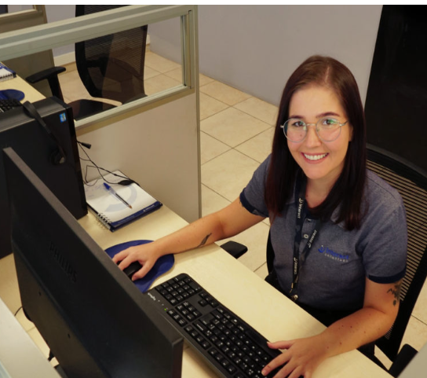

| **Idade**              | 32 anos                    |
|------------------------|----------------------------|
| **Principais aplicativos** | Banking; Whatsapp; Instagram; TikTok; YouTube; Twitter Streaming;|
| **Ocupação**           | Profissional de TI  |
| **Motivações**         | * Encontrar uma solução que se adapte à sua agenda agitada e facilite a programação de um momento de lazer no fim de semana. *Quer um aplicativo que forneça informações precisas sobre horários de exibição e disponibilidade de ingressos para que possa planejar com antecedência.|
| **Objetivos**          | Seguir evoluindo profissionalmente |
| **Hobbies**            | Leitura; Filmes e Séries; Revistas cientificas; Viagens |
|**Frustrações**         |* Não ter tempo para buscar informações sobre os filmes em cartaz e acabar perdendo oportunidades de lazer.* Encontrar aplicativos confusos ou com pouca atualização sobre os horários de exibição, dificultando a escolha e a compra de ingressos. |

### Pedro Braga

| **Idade**              | 65 anos                    |
|------------------------|----------------------------|
| **Principais aplicativos** | Banking; Whatsapp; Facebook; YouTube; Twitter; Streaming; |
| **Ocupação**           | Aposentado |
| **Motivações**         | *Desfrutar de sua aposentadoria explorando diferentes atividades culturais, como ir ao cinema frequentemente. *Valoriza um aplicativo intuitivo que ofereça uma variedade de opções de filmes em cartaz, permitindo-lhe escolher com facilidade.|
| **Objetivos**          | Viajar o mundo, e se divertir |
| **Hobbies**            | Leitura; Filmes e Séries; Viagens |
|**Frustrações**         |* Encontrar aplicativos complicados de usar ou que não atendam às suas preferências de filmes.* Não conseguir informações claras sobre os filmes em cartaz, como trailers e sinopses, dificultando a tomada de decisão.|

### Carolina Melo

| **Idade**              | 65 anos                    |
|------------------------|----------------------------|
| **Principais aplicativos**  | Banking; Streaming; Whatsapp; Instagram; TikTok; YouTube; Twitter |
| **Ocupação**           | Estudante  |
| **Motivações**         | * Compartilhar suas experiências cinematográficas com amigos nas redes sociais e ficar por dentro das últimas tendências.* Quer um aplicativo que ofereça recomendações personalizadas com base em seus gostos e integre recursos sociais para compartilhamento fácil.|
| **Objetivos**          | Viajar o mundo, e ser fazer teatro |
| **Hobbies**            | Leitura; Filmes e Séries; Teatro |
|**Frustrações**         |*Não encontrar um aplicativo que acompanhe suas preferências e interesses cinematográficos, tornando difícil a escolha de um filme para assistir com os amigos.*Não poder compartilhar suas experiências e opiniões sobre os filmes facilmente nas redes sociais devido à falta de integração com aplicativos de mídia social.Gostaria de receber uma notificação de filmes comprados.|

|EU COMO... `PERSONA`| QUERO/PRECISO ... `FUNCIONALIDADE` |PARA ... `MOTIVO/VALOR`                 |
|--------------------|------------------------------------|----------------------------------------|
|Lucas Oliveira          | Logar na aplicação - Filtragem de Cinemas                 | Possuir minha própria conta - Filtrar os cinemas           |
|Ana Machado              | Me cadastrar na aplicação - Reserva de Assentos          | Ter meu próprio perfil  e fazer reservas               |
|Pedro Braga               | Visualização de Informações do Cinema   -  Notificações aos Usuários de novidade      | Fins de planejamento                   |
|Carolina Melo             | Compra de Ingressos -Histórico de Compras  -Avaliação do filme        | Fins de praticidade                   |

## Modelagem do Processo de Negócio 

### Análise da Situação Atual

A empresa Cine Br, atuante no mercado de entretenimento cinematográfico, tem desempenhado um papel fundamental ao facilitar o acesso do público aos mais recentes lançamentos cinematográficos. Com uma plataforma de compra de ingressos online, a Cine Br tem oferecido aos seus clientes a conveniência de reservar seus lugares nos cinemas parceiros de forma rápida e fácil, sem a necessidade de enfrentar filas ou preocupações de última hora.

Nesta análise, examinaremos tanto a situação atual da empresa Cine Br quanto suas perspectivas futuras. Inicialmente, destacaremos os pontos fortes e fracos da plataforma atual, identificando áreas que já se destacam e aspectos que requerem melhorias. Em seguida, exploraremos as oportunidades de crescimento e as possíveis soluções para aprimorar a experiência do cliente e manter a competitividade no mercado.

Com base nessa análise, será possível compreender melhor os desafios enfrentados pela empresa Cine Br e as estratégias necessárias para impulsionar seu crescimento e sucesso no cenário de compra de ingressos online.

* Análise Atual da Empresa Cine Br
Pontos Fortes:
Variedade de Cinemas: A empresa Cine Br oferece uma ampla variedade de cinemas parceiros em diversas localidades, proporcionando aos clientes uma gama de opções para assistir aos filmes.

Experiência do Usuário: A plataforma atual oferece uma experiência de usuário relativamente amigável, permitindo que os clientes naveguem pelos filmes em cartaz, horários e realizem compras de ingressos de forma intuitiva.

Parcerias Estabelecidas: A Cine Br possui parcerias consolidadas com grandes redes de cinemas, o que fortalece sua posição no mercado e amplia sua base de clientes.

Pontos Fracos:
Falta de Personalização: A plataforma atual não oferece recursos de personalização ou recomendações de filmes com base nas preferências dos usuários, o que pode limitar a experiência do cliente.

Processo de Compra Complexo: Alguns usuários relatam que o processo de compra de ingressos pode ser complicado, especialmente em relação à seleção de assentos e métodos de pagamento.

Concorrência Acirrada: A empresa enfrenta forte concorrência de outras plataformas de compra de ingressos online, algumas das quais oferecem recursos mais avançados e uma experiência de usuário melhorada.

* Análise futura da empresa Cine Br:

Análise Futura da Empresa Cine Br
Oportunidades de Melhoria:
Personalização e Recomendações: Implementar recursos de personalização e recomendações de filmes com base no histórico de compras e preferências dos usuários para melhorar a experiência do cliente e aumentar a fidelidade.

Simplificação do Processo de Compra: Aprimorar o processo de compra de ingressos, tornando-o mais simples e intuitivo, com opções claras de seleção de assentos, métodos de pagamento e emissão de ingressos digitais.

Integração com Redes Sociais: Integrar a plataforma com redes sociais para permitir que os usuários compartilhem suas experiências cinematográficas, promovendo assim a marca e expandindo o alcance da empresa.

Investimentos Necessários:
Desenvolvimento de Novos Recursos: Será necessário investir em desenvolvimento de software para implementar novos recursos, como personalização, recomendações e integração com redes sociais.

Treinamento de Funcionários: Os funcionários precisarão ser treinados para lidar com as novas funcionalidades da plataforma e garantir um suporte eficaz ao cliente.

Campanhas de Marketing: Investir em campanhas de marketing para promover as novas melhorias e atrair novos usuários para a plataforma.

Potenciais Desafios:
Adoção pelo Usuário: Garantir que os usuários adotem as novas funcionalidades pode ser um desafio, especialmente se houver resistência à mudança ou se as melhorias não atenderem às expectativas dos clientes.

Concorrência Crescente: Continuar a enfrentar a concorrência de outras plataformas de compra de ingressos online exigirá esforços contínuos para inovar e melhorar a experiência do usuário.

Gestão de Dados e Segurança: Com a implementação de novos recursos de personalização e integração com redes sociais, será fundamental garantir a segurança dos dados dos usuários e cumprir as regulamentações de privacidade.

Esta análise atual e futura da empresa Cine Br oferece uma visão abrangente dos pontos fortes, pontos fracos, oportunidades, investimentos necessários e potenciais desafios associados à evolução da plataforma de compra de ingressos online.

### Processo 1 – Verificar minhas reservas 

Apresente aqui o nome e as oportunidades de melhorias para o processo 1. Em seguida, apresente o modelo do processo 1, descrito no padrão BPMN. 

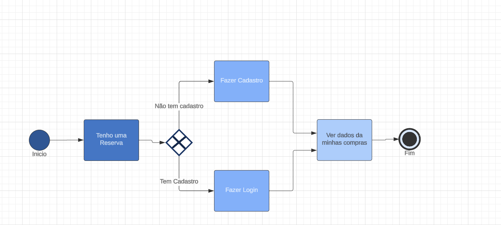

### Processo 2 – Fazer uma compra ao site

Apresente aqui o nome e as oportunidades de melhorias para o processo 2. Em seguida, apresente o modelo do processo 2, descrito no padrão BPMN. 

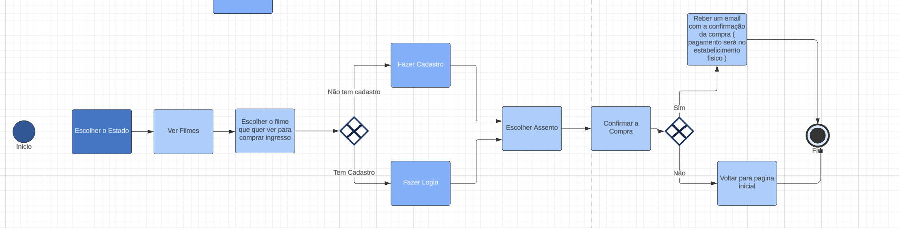

Processo 3 – Cadastro de Usuário
O processo de cadastro de Usuário pode ser visto a seguir:

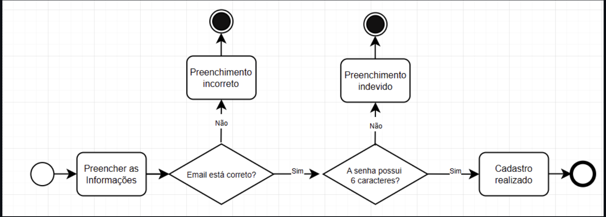

Processo 3 – Login
O processo de login pode ser visto a seguir:
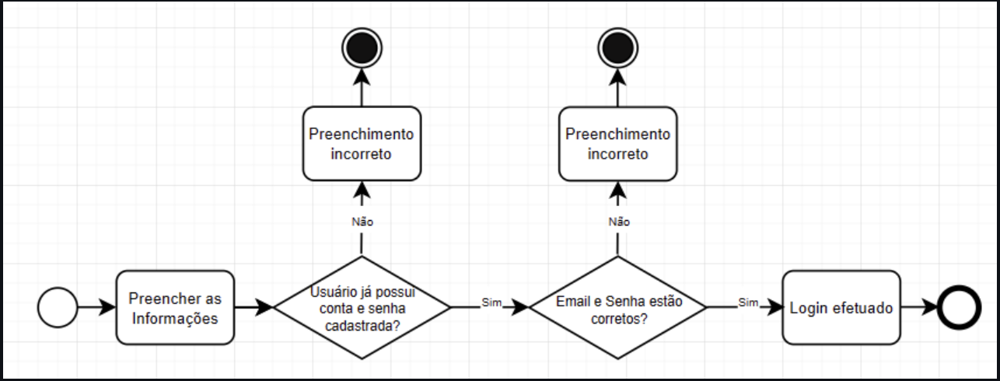

## Indicadores de Desempenho

Apresente aqui os principais indicadores de desempenho e algumas metas para o processo. Atenção: as informações necessárias para gerar os indicadores devem estar contempladas no diagrama de classe. Colocar no mínimo 5 indicadores. 

Usar o seguinte modelo: 

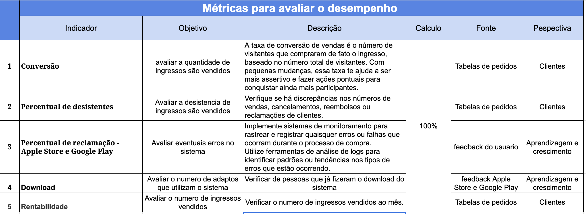
Obs.: todas as informações para gerar os indicadores devem estar no diagrama de classe a ser apresentado a posteriori. 

### Gráfico Burndown 
Ao longo do projeto utilizaremos o gráfico burndown para avaliar o desempenho da equipe. O gráfico é definido relacionando a duração das etapas de desenvolvimento previamente definidas à quantidade de tarefas que devem ser realizadas. 

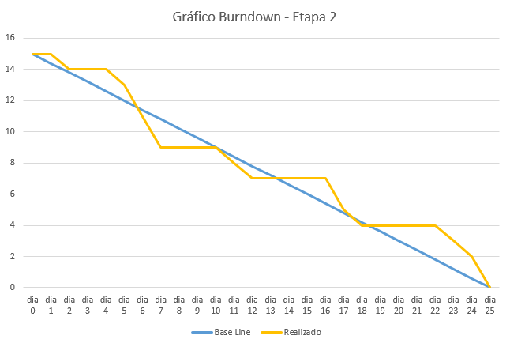

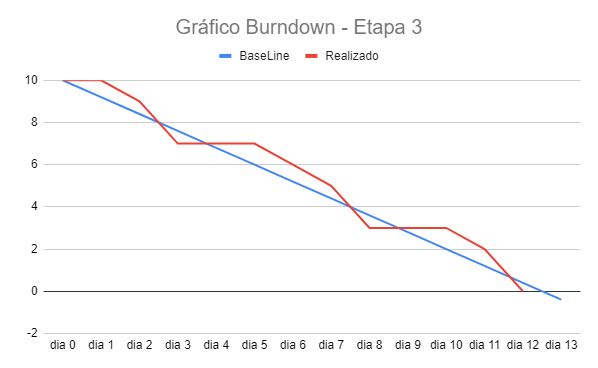

## Requisitos

As tabelas que se seguem apresentam os requisitos funcionais e não funcionais que detalham o escopo do projeto. Para determinar a prioridade de requisitos, aplicar uma técnica de priorização de requisitos e detalhar como a técnica foi aplicada.

### Requisitos Funcionais

|ID    | Descrição do Requisito  | Prioridade |
|------|-------------------------|----|
|RF-001| Cadastro de Usuário | ALTA | 
|RF-002| Pesquisa de Cinemas por cidade | ALTA |
|RF-003| Visualização de Informações do Cinema | ALTA |
|RF-004| Filtragem de Cinemas | MÉDIA |
|RF-005| Compra de Ingressos | ALTA |
|RF-006| Reserva de Assentos (se disponível) | MÉDIA |
|RF-007| Notificações aos Usuários de novidades| MÉDIA |
|RF-008| Histórico de Compras | BAIXA |
|RF-009| Avaliação do filme | MÉDIA |

### Requisitos não Funcionais

|ID     | Descrição do Requisito  |Prioridade |
|-------|-------------------------|----|
|RNF-001| Usabilidade Intuitiva | ALTA | 
|RNF-002| Desempenho com tempos de carregamento rápidos | ALTA | 
|RNF-003| Segurança dos dados do usuário | ALTA |
|RNF-005| Compatibilidade com múltiplos dispositivos e sistemas | ALTA |
|RNF-007| Manutenibilidade do código | BAIXA |
|RNF-009| Localização precisa e relevância de resultados | MÉDIA |
|RNF-010| Acessibilidade para diferentes necessidades | ALTA |

## Restrições

O projeto está restrito pelos itens apresentados na tabela a seguir.

|ID| Restrição                                             |
|--|-------------------------------------------------------|
|01| O projeto deverá ser entregue até o final do semestre |
|02| Não pode ser desenvolvido um módulo de backend        |

Enumere as restrições à sua solução. Lembre-se de que as restrições geralmente limitam a solução candidata.

> **Links Úteis**:
> - [O que são Requisitos Funcionais e Requisitos Não Funcionais?](https://codificar.com.br/requisitos-funcionais-nao-funcionais/)
> - [O que são requisitos funcionais e requisitos não funcionais?](https://analisederequisitos.com.br/requisitos-funcionais-e-requisitos-nao-funcionais-o-que-sao/)

## Diagrama de Casos de Uso

 

# Matriz de Rastreabilidade

A matriz de rastreabilidade é uma ferramenta usada para facilitar a visualização dos relacionamento entre requisitos e outros artefatos ou objetos, permitindo a rastreabilidade entre os requisitos e os objetivos de negócio. 

A matriz deve contemplar todos os elementos relevantes que fazem parte do sistema, conforme a figura meramente ilustrativa apresentada a seguir.

> **Links Úteis**:
> - [Artigo Engenharia de Software 13 - Rastreabilidade](https://www.devmedia.com.br/artigo-engenharia-de-software-13-rastreabilidade/12822/)
> - [Verificação da rastreabilidade de requisitos usando a integração do IBM Rational RequisitePro e do IBM ClearQuest Test Manager](https://developer.ibm.com/br/tutorials/requirementstraceabilityverificationusingrrpandcctm/)
> - [IBM Engineering Lifecycle Optimization – Publishing](https://www.ibm.com/br-pt/products/engineering-lifecycle-optimization/publishing/)

# Gerenciamento de Projeto

De acordo com o PMBoK v6 as dez áreas que constituem os pilares para gerenciar projetos, e que caracterizam a multidisciplinaridade envolvida, são: Integração, Escopo, Cronograma (Tempo), Custos, Qualidade, Recrsos, Comunicações, Riscos, Aquisições, Partes Interessadas. Para desenvolver projetos um profissional deve se preocupar em gerenciar todas essas dez áreas. Elas se complementam e se relacionam, de tal forma que não se deve apenas examinar uma área de forma estanque. É preciso considerar, por exemplo, que as áreas de Escopo, Cronograma e Custos estão muito relacionadas. Assim, se eu amplio o escopo de um projeto eu posso afetar seu cronograma e seus custos.

## Gerenciamento de Tempo

Diagrama de rede simplificado:

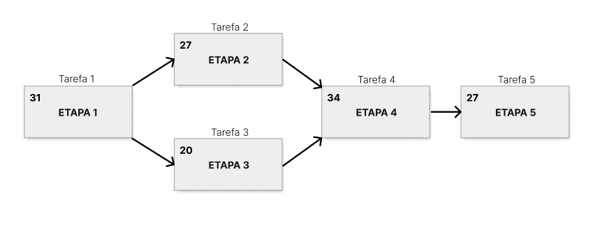

Gráfico de Gantt: https://docs.google.com/spreadsheets/d/1EGeWAzJPXGF_q-uNGWzKq600urpc-4s7dkMSV1dHCTs/edit?usp=sharing

Preview da planilha:

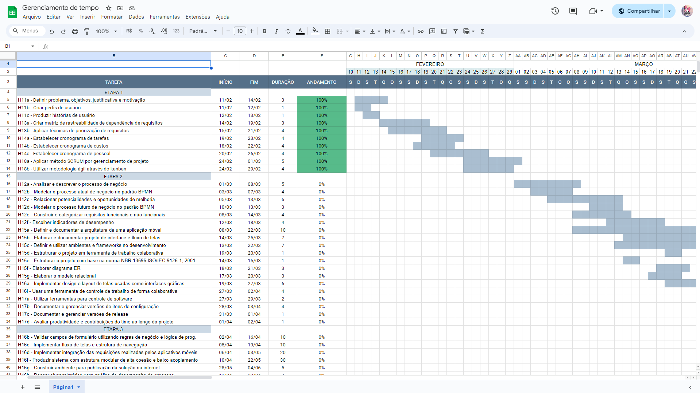

## Gerenciamento de Equipe

## Gestão de Orçamento

O processo de determinar o orçamento do projeto depende não apenas dos resultados dos processos anteriores de gerenciamento de custos, mas também dos produtos fornecidos por outros processos de gerenciamento, como escopo e tempo.
Pensando nisso foi estabelecido a tabela que demonstra o gastos que todo grupo terá para desenvolver esse projeto:

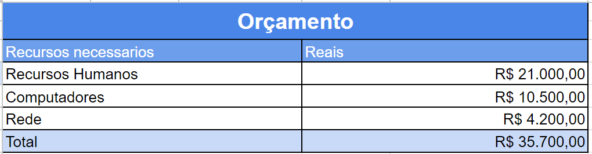
