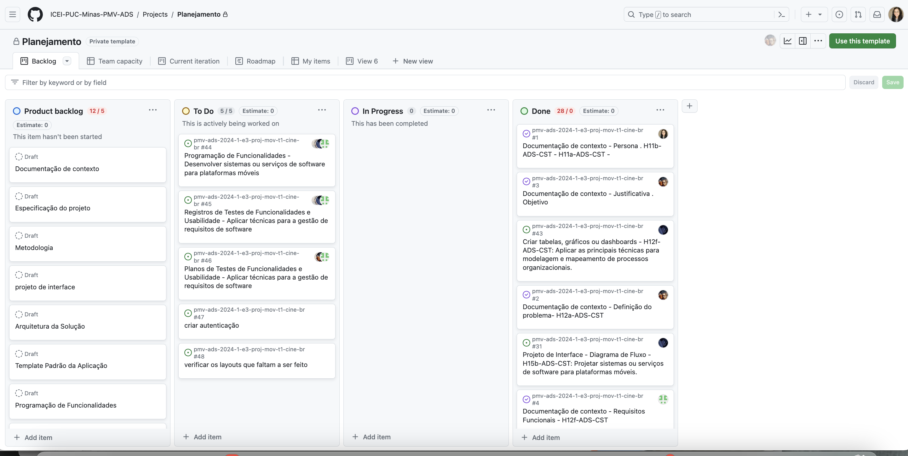

# Metodologia

Pré-requisitos: <a href="2-Especificação do Projeto.md"> Documentação de Especificação</a>

A metodologia é uma etapa crucial no desenvolvimento do projeto, pois como disse Pitágoras, "com organização e tempo, acha-se o segredo de fazer tudo e bem feito". Levando isso em consideração, a equipe optou por utilizar uma variedade de ferramentas, abrangendo organização, agilidade, manutenção de código, comunicação e outras áreas relevantes, as quais serão mencionadas neste tópico.

## Relação de Ambientes de Trabalho

Toda ferramenta tem seu propósito; a tabela seguinte irá explicar em que ambiente, e para que, a equipe fez uso delas.

|              Ambiente              |  Plataforma  |                                    Link de Acesso                                    |
|:----------------------------------:|:------------:|:------------------------------------------------------------------------------------:|
|     Repositório de código fonte    |    GitHub    | [https://github.com/ICEI-PUC-Minas-PMV-ADS/pmv-ads-2022-2-e1-proj-web-t4-filmes  ](https://github.com/ICEI-PUC-Minas-PMV-ADS/pmv-ads-2024-1-e3-proj-mov-t1-cine-br)|
|        Documentos do projeto       | Teams | [https://drive.google.com/drive/folders/1POynLcQ6bOiBFRq-0w5JRyjmy7eRR508?usp=sharing](https://sgapucminasbr.sharepoint.com/:f:/s/team_sga_2418_2024_1_8512101-Time3-/EjX_trc0YHxOkz6cm5WIQ1wBE3HIE0uDxs2p96qWfP2vNQ?e=XKHpvD) |
| Projeto de Interface e  Wireframes |   Figma  | (https://www.figma.com/file/9zmCe67bVCwrT2sTmY3ZHb/Untitled?type=design&node-id=0%3A1&mode=design&t=kB2Nii0n5O7YwS                             |
|      Gerenciamento do Projeto      |    GitHub    | [https://trello.com/b/TMofVulh](https://github.com/orgs/ICEI-PUC-Minas-PMV-ADS/projects/768/views/1) |

## Controle de Versão

A ferramenta de controle de versão selecionada para o projeto foi o Git, enquanto o Github foi escolhido para hospedar o repositório.

O projeto segue uma convenção específica para nomear os branches:

- main: refere-se à versão estável e testada do software.
- unstable: indica uma versão do software que foi testada, mas ainda é instável.
- testing: representa a versão em fase de testes do software.
- dev: corresponde à versão de desenvolvimento em andamento do software.

Em relação à gestão de problemas (issues), o projeto adota a seguinte convenção para etiquetas:

- documentation: para melhorias ou adições à documentação.
- bug: para identificar funcionalidades com problemas.
- enhancement: para indicar melhorias necessárias em funcionalidades existentes.
- feature: para sugerir a introdução de novas funcionalidades.

## Gerenciamento de Projeto

### Divisão de Papéis

Com o objetivo de maximizar a eficiência na realização das tarefas em um prazo reduzido, a equipe optou por adotar metodologias ágeis, especificamente o Scrum, para orientar o processo de desenvolvimento. Nessa abordagem, cada membro da equipe é responsável por assumir uma ou mais funções e responsabilidades claras em cada estágio do projeto, visando uma colaboração criativa e adaptável para alcançar o resultado final de maneira harmoniosa.

Além do Scrum, o projeto também incorpora princípios do Microsoft Solutions Framework (MSF), um framework flexível projetado para orientar projetos de desenvolvimento de software. Combinando os princípios do Scrum com os mindsets do MSF, a equipe adota os seguintes conceitos:

- Qualidade definida pelo cliente: Os usuários fornecem feedback contínuo para garantir que o site atenda às suas necessidades, especialmente considerando que se baseia nas avaliações dos usuários.

- Trabalho em pares: Dada a complexidade do projeto, muitas tarefas serão realizadas em colaboração, o que acelera o desenvolvimento e melhora a qualidade geral.-

- Entrega frequente de versões: O desenvolvimento ágil permite que partes do site sejam implementadas rapidamente, testadas, revisadas e potencialmente melhoradas em um ciclo contínuo.

- Desejo de aprender: Reconhecendo a natureza desafiadora do desenvolvimento do site, cada membro da equipe se compromete a aprender continuamente novas habilidades para melhorar suas contribuições.

- Orgulho no trabalho individual: À medida que os membros da equipe adquirem novas habilidades e superam desafios, eles se sentem realizados e motivados a continuar contribuindo de maneira significativa para o projeto.

A equipe está organizada da seguinte forma: 

### Scrum Master: 

- Geovanne do Monte Ribeiro

- Product Owner: 

-Mayra Gabriella Vitoriana Machado Rodriguez

###  Equipe de Desenvolvimento:

- Arthur Oliveira
- Bianca Cristina Sousa Santana
- Otávio Cavallieri Silva

###  Equipe de Design:

- Lucas Emanuel Pereira Rodrigues
- Peterson Alves Gervazio

### Processo

Para organização e distribuição das tarefas do projeto, a equipe está utilizando o GitHub Projects. As etapas são classificadas em:

Backlog do Produto: Todos os artefatos que serão necessários para o desenvolvimento completo do projeto.
A Fazer: Todos os artefatos referentes à etapa atual do desenvolvimento do projeto.
Em Desenvolvimento: Todos os artefatos que estão sendo desenvolvidos no momento.
Em Revisão: Todos os artefatos que já foram desenvolvimentos mas estão em processo de testes.
Finalizado: Todos os artefatos que foram testados, aprovados e implementados no projeto.

_Quadro Kanban - GitHub Projects_

### Ferramentas

As ferramentas empregadas no projeto são:

Editor de código: Visual Studio Code e EXPO
Ferramentas de comunicação: WhatsApp, Discord, Teams
Ferramentas de desenho de tela (wireframing): Figma
Ferramenta de desenho de diagramas e fluxogramas: Canva, Lucidchart e Diagrams.net
SGBD: SQLite
O editor de código foi escolhido porque ele possui uma integração com o sistema de versão, além de se mostrar versátil.

As ferramentas de comunicação utilizadas possuem integração semelhante e por isso foram selecionadas.

Por fim, para criar diagramas utilizamos essa ferramenta por melhor captar as necessidades da nossa solução.
