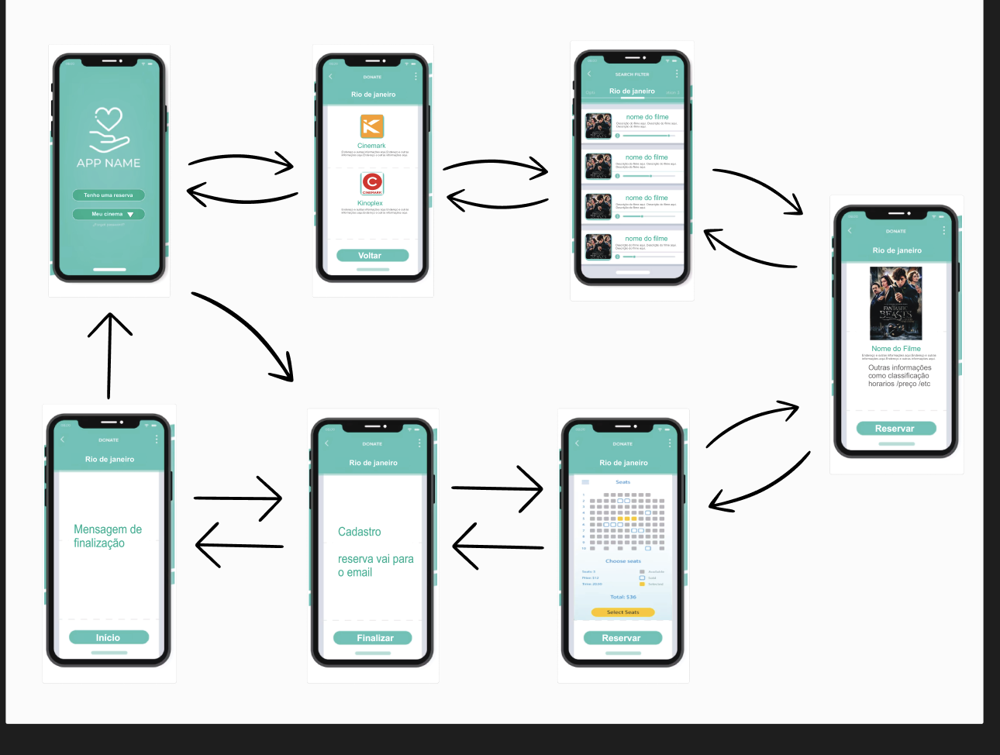
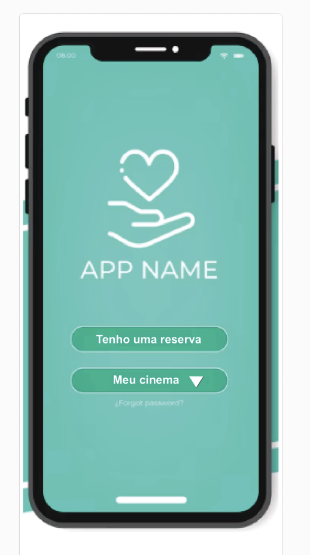
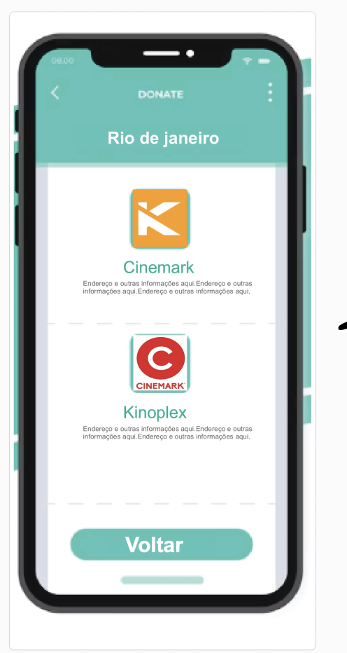
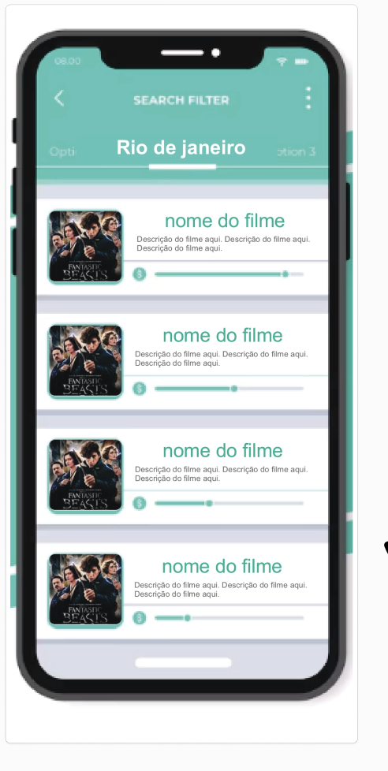
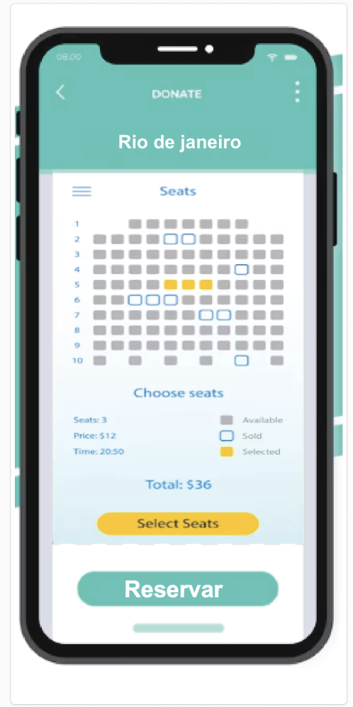

# Projeto de Interface

Pré-requisitos: <a href="2-Especificação do Projeto.md"> Documentação de Especificação</a>

Visão geral da interação do usuário pelas telas do sistema e protótipo interativo das telas com as funcionalidades que fazem parte do sistema (wireframes).

 Apresente as principais interfaces da plataforma. Discuta como ela foi elaborada de forma a atender os requisitos funcionais, não funcionais e histórias de usuário abordados nas <a href="2-Especificação do Projeto.md"> Documentação de Especificação</a>.

## Diagrama de Fluxo

O diagrama apresenta o estudo do fluxo de interação do usuário com o sistema interativo e  muitas vezes sem a necessidade do desenho do design das telas da interface. Isso permite que o design das interações seja bem planejado e gere impacto na qualidade no design do wireframe interativo que será desenvolvido logo em seguida.

As referências abaixo irão auxiliá-lo na geração do artefato “Diagramas de Fluxo”.

> **Links Úteis**:
> - [Fluxograma online: seis sites para fazer gráfico sem instalar nada | Produtividade | TechTudo](https://www.techtudo.com.br/listas/2019/03/fluxograma-online-seis-sites-para-fazer-grafico-sem-instalar-nada.ghtml)

## Wireframes

A princípio, o Projeto tem como escopos principais a celeridade de processamento e a praticidade de acesso. Tais pontos são essenciais para tornar a experiência do usuário a mais positiva possível. Por último, também é uma meta a responsividade do site com o intuito de estabelecer o acesso em mais de um tipo de dispositivo eletroeletrônico.

O Diagrama abaixo na Figura 2 demonstra o fluxo de interação do usuário pelas telas do sistema. Cada tela deste fluxo será apresentada na seção de wireframes que segue abaixo. Disponibilizamos o link do site para visualização:

**TELA DE INÍCIO - 1** 

Tela – Home

De acordo com o fluxo de telas do projeto apresentado anteriormente, as telas do sistema serão detalhadas nos itens subsequentes. As telas do sistema possuem uma estrutura comum, que é exemplificada na Figma. Essa estrutura consiste em três grandes blocos, que são descritos a seguir:

Barra Menu: Barra menu do app

Conteúdo: tem dois boetoes de navegação escolha o seu estado e tenho uma reserva.

**TELA DE CINEMAS -2**

Tela – Escolha o seu cinema

Tela que mostrará os cinemas disponiveis. 

Barra Menu: Barra menu do app

Conteúdo: aparecera os cinemas disponiveis 

**TELA DE FILMES - 3**

Tela onde é mostrado os filmes disponíveis.

Barra Menu: Barra menu do app

Conteúdo: aparecera os filmes disponiveis 

**TELA DE RESERVA - 5**

Nesta tela o usuário pode ver e escolher os assentos , e logo abaixo possui um botão de reserva que pode ser clicado após ser escolhido o assento

Barra Menu: Barra menu do app

Conteúdo: aparecerá mais informações detalhadas do filme e um botão para fazer a reserva 

**TELA DE FILME SELECIONADO - 4**

Nesta tela o usuário pode ver sobre o filme que ele escolheu, e também possui um botão para fazer sua reserva

Barra Menu: Barra menu do app

Conteúdo: aparecerá as cadeiras disponiveis 

**TELA DE CADASTRO - 6**

Nesta tela o usuário pode fazer seu cadastro caso não possuir, ou se já possui fazer o login. E um botão para finalizar a reserva

CONTEÚDO:
Barra Menu: Barra menu do app

Conteúdo: cliente poderá fazer cadastro ou login no app

**TELA FINAL - 7**

Possui uma mensagem de finalização e logo abaixo um botão de início

CONTEÚDO:
Barra Menu: Barra menu do app

Conteúdo: aparecerá uma mensagem de compra concluida.

**LINK DO WIREFRAME NO FIGMA**
https://www.figma.com/file/9zmCe67bVCwrT2sTmY3ZHb/Untitled?type=design&node-id=0%3A1&mode=design&t=kB2Nii0n5O7YwShV-1

 
> **Links Úteis**:
> - [Protótipos vs Wireframes](https://www.nngroup.com/videos/prototypes-vs-wireframes-ux-projects/)
> - [Ferramentas de Wireframes](https://rockcontent.com/blog/wireframes/)
> - [MarvelApp](https://marvelapp.com/developers/documentation/tutorials/)
> - [Figma](https://www.figma.com/)
> - [Adobe XD](https://www.adobe.com/br/products/xd.html#scroll)
> - [Axure](https://www.axure.com/edu) (Licença Educacional)
> - [InvisionApp](https://www.invisionapp.com/) (Licença Educacional)
