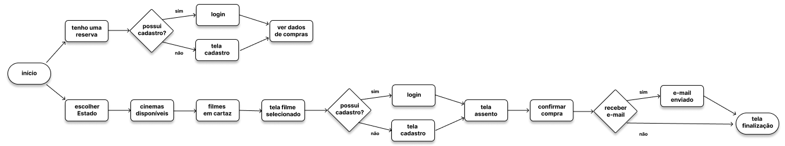

# Projeto de Interface

Pré-requisitos: <a href="2-Especificação do Projeto.md"> Documentação de Especificação</a>

Visão geral da interação do usuário pelas telas do sistema e protótipo interativo das telas com as funcionalidades que fazem parte do sistema (wireframes).

 Apresente as principais interfaces da plataforma. Discuta como ela foi elaborada de forma a atender os requisitos funcionais, não funcionais e histórias de usuário abordados nas <a href="2-Especificação do Projeto.md"> Documentação de Especificação</a>.

## Diagrama de Fluxo

O diagrama apresenta o estudo do fluxo de interação do usuário com o sistema interativo e  muitas vezes sem a necessidade do desenho do design das telas da interface. Isso permite que o design das interações seja bem planejado e gere impacto na qualidade no design do wireframe interativo que será desenvolvido logo em seguida.

As referências abaixo irão auxiliá-lo na geração do artefato “Diagramas de Fluxo”.

> **Links Úteis**:
> - [Fluxograma online: seis sites para fazer gráfico sem instalar nada | Produtividade | TechTudo](https://www.techtudo.com.br/listas/2019/03/fluxograma-online-seis-sites-para-fazer-grafico-sem-instalar-nada.ghtml)

## Wireframes

São protótipos usados em design de interface para sugerir a estrutura de um site web e seu relacionamentos entre suas páginas. Um wireframe web é uma ilustração semelhante do layout de elementos fundamentais na interface.

**TELA DE INÍCIO - 1** 

Fica no centro da tela, possui a logo do APP e os botões para navegação.

CONTEÚDO:
- Ao clicar no primeiro botão (Tenho uma reserva) caso possuir cadastro, o usuário é direcionado para a tela de reserva, caso contrário é direcionado para a tela de cadastro.
- Ao clicar no segundo botão (Meu cinema), o usuário é direcionado para tela de cinemas.

**TELA DE CINEMAS -2**

Tela onde podem ser visualizados os cinemas.

CONTEÚDO:
- O usuário tem as opções dos cinemas que estão disponíveis para sua escolha.
- Ao clicar em alguns dos cinemas, o usuário e direcionado para os Filmes disponíveis.

**TELA DE FILMES - 3**

Tela onde é mostrado os filmes disponíveis.

CONTEÚDO:
- Os filmes disponíveis são todos exibidos nessa tela.
- Ao clciar em algum dos filmes o usuário é direcionado para a tela de informação do filme.

**TELA DE FILME SELECIONADO - 4**

Nesta tela o usuário pode ver sobre o filme que ele escolheu, e também possui um botão para fazer sua reserva

CONTEÚDO:
- O usuário tem disponível nessa tela todas as informações sobre o filme escolhido, como nome do filme, descrição, classificação, horários , preços, entre outros.
- Ao clicar em reservar o usuário é direcionado para a tela de reserva.

**TELA DE RESERVA - 5**

Nesta tela o usuário pode ver e escolher os assentos , e logo abaixo possui um botão de reserva que pode ser clicado após ser escolhido o assento

CONTEÚDO:
- O usuário tem a liberdade para escolher os assentos (que estão disponíveis), após sua escolha, basta fazer a reserva
- Ao clicar no botão de reservar , o usuário é levado para a tela de cadastro para finalizar a reserva.

**TELA DE CADASTRO - 6**

Nesta tela o usuário pode fazer seu cadastro caso não possuir, ou se já possui fazer o login. E um botão para finalizar a reserva

CONTEÚDO:
- O usuário pode fazer o seu cadastro no app para concluir a reserva, respondendo os campos exigidos. Caso já possua uma conta, basta logar para concluir sua reserva. Após esse processo, a reserva será enviada para o e-mail cadastrado.
- Ao clicar no botão de Finalizar o usuário finaliza sua reserva, e é direcionado para a tela final.

**TELA FINAL - 7**

Possui uma mensagem de finalização e logo abaixo um botão de início

CONTEÚDO:
- Uma mensagem de finalização é exibida na tela após ser feito todo o processo
- Ao clicar no botão de início o usuário é direcionado para a tela inicial

**LINK DO WIREFRAME NO FIGMA**
https://www.figma.com/file/9zmCe67bVCwrT2sTmY3ZHb/Untitled?type=design&node-id=0%3A1&mode=design&t=kB2Nii0n5O7YwShV-1

 
> **Links Úteis**:
> - [Protótipos vs Wireframes](https://www.nngroup.com/videos/prototypes-vs-wireframes-ux-projects/)
> - [Ferramentas de Wireframes](https://rockcontent.com/blog/wireframes/)
> - [MarvelApp](https://marvelapp.com/developers/documentation/tutorials/)
> - [Figma](https://www.figma.com/)
> - [Adobe XD](https://www.adobe.com/br/products/xd.html#scroll)
> - [Axure](https://www.axure.com/edu) (Licença Educacional)
> - [InvisionApp](https://www.invisionapp.com/) (Licença Educacional)
