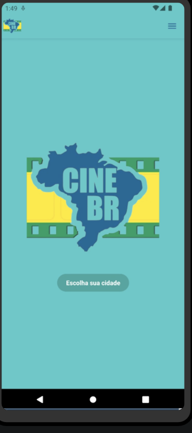
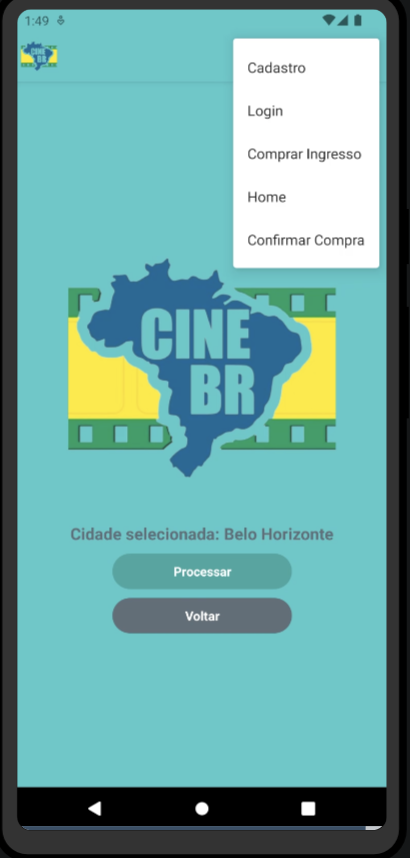
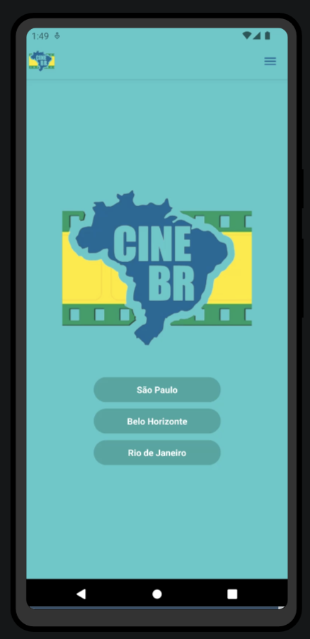
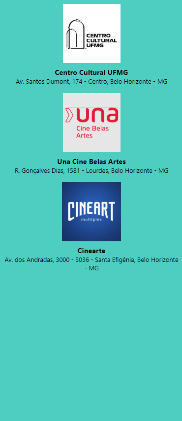
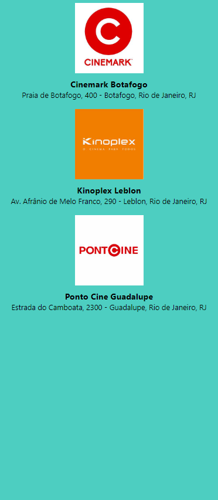
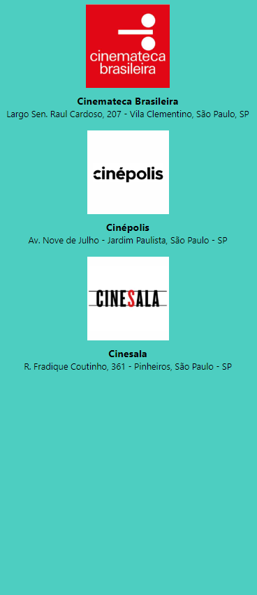
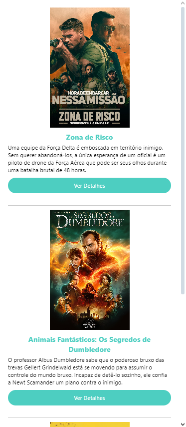
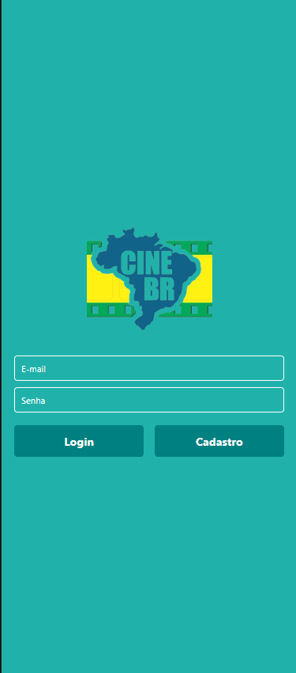
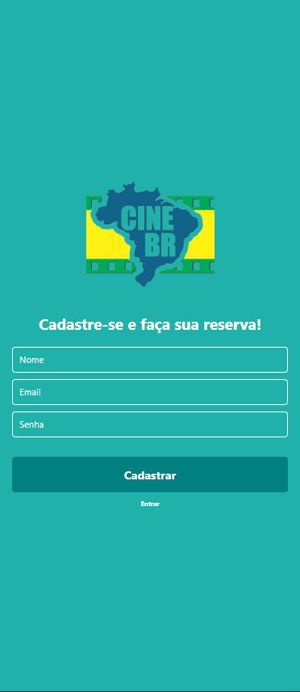
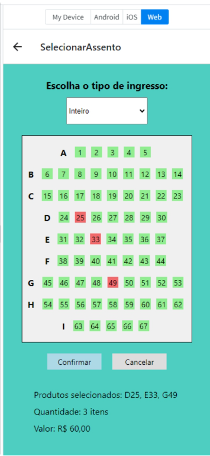

# Template Padrão da Aplicação

# 1. Introdução
A documentação a seguir detalha o Template Padrão da Aplicação, fornecendo diretrizes essenciais para o design e desenvolvimento de todas as páginas do aplicativo. Este documento delineia as orientações de design, identidade visual, responsividade e iconografia que serão seguidas ao longo do projeto.

# 2. Metodologia
2.1 Escolha da Metodologia
A metodologia adotada para orientar a criação do Template Padrão da Aplicação é a Scrum.

## 2.2 Descrição da Metodologia
A Scrum é uma abordagem ágil que valoriza a entrega iterativa e incremental de software, promovendo a colaboração, adaptação e transparência. No contexto deste projeto, a metodologia Scrum será aplicada para garantir uma abordagem flexível e orientada a resultados no desenvolvimento do Template Padrão da Aplicação. Os princípios fundamentais da Scrum, como foco no cliente, adaptação contínua e entrega frequente de valor, serão incorporados ao longo do processo de desenvolvimento.

## 2.3 Papéis e Responsabilidades
- Designer de Interface: Responsável por criar os elementos visuais do Template Padrão, garantindo consistência e usabilidade.
- Desenvolvedores Front-end: Encarregados de implementar o design do Template Padrão de acordo com as especificações fornecidas pelo designer.
- Gerente de Projeto: Responsável por coordenar as atividades de design e desenvolvimento, garantindo que o Template Padrão atenda aos requisitos do projeto.
## 2.4 Processo de Desenvolvimento
- Pesquisa e Análise: Compreensão das necessidades do usuário e análise de tendências de design.
- Concepção e Prototipagem: Criação de wireframes e protótipos para validar o layout e a usabilidade.
- Design Visual: Desenvolvimento dos elementos visuais do Template Padrão, incluindo paleta de cores, tipografia e ícones.
- Desenvolvimento Front-end: Implementação do design visual utilizando React Native.
- Testes e Iterações: Realização de testes de usabilidade e feedback da equipe para refinamento do Template Padrão.
## 2.5 Ferramentas e Recursos
- Ferramentas de Design: Figma, Adobe XD.
- Ferramentas de Desenvolvimento: Expo, Visual Studio Code, React Native CLI.
- Ferramentas de Colaboração: Microsoft Teams, Trello, GitHub.
## 2.6 Comunicação e Colaboração
- Reuniões Regulares: Semanais para acompanhamento do progresso e alinhamento de objetivos.
- Canais de Comunicação Online: Teams, e-mails e ferramentas de gerenciamento de projetos para comunicação instantânea.
- Revisões de Design: Sessões regulares para revisão e feedback do design do Template Padrão.
## 2.7 Melhoria Contínua
- Feedback da Equipe: Incorporação de feedback contínuo da equipe para aprimoramento do Template Padrão ao longo do tempo.
- Feedback dos Usuários: Coleta de feedback dos usuários finais para identificar oportunidades de melhoria no design e na usabilidade.
# 3. Diretrizes de Design
## 3.1 Identidade Visual
- Paleta de Cores: Cor principal #4DCEC1 
, cor secundária #3AA895 
.
- Tipografia: Fonte padrão do React Native.
- Iconografia: Não aplicável.
## 3.2 Responsividade
O Template Padrão será desenvolvido com foco na responsividade, garantindo uma experiência consistente em diferentes dispositivos e tamanhos de tela.

## 3.3 Layout
O layout base será consistente em todas as páginas do aplicativo, seguindo as diretrizes de design estabelecidas no projeto.
- Tela Home
- Tela Cidades
- Tela Cinemas
- Tela Filmes
- Tela Assentos
- Tela Login/Cadastro
---

<h3>TELA HOME</h3>

Na tela home, temos as seguintes opções: 
- Escolher a cidade desejada.
- E também podemos acessar o menu, que está na NavBar, onde contém algumas opções disponíveis que nos direciona para outras telas do App.

---
<h3>TELA CIDADES</h3>

Na tela de cidades, temos as opções das cidades disponíveis e também conseguimos acessar o menu através da NavBar.

---

<h3>TELA CINEMAS</h3>

Após escolher a cidade desejada, o usuário é direcionado para a tela de cinemas disponíveis de acordo com a cidade escolhida.

- Cinemas Belo Horizente.
  

- Cinemas Rio de Janeiro.
  

- Cinemas São Paulo.
  

---

<h3>TELA FILMES</h3>

Tela de filmes disponíveis de acordo com o cinema escolhido. Também é possível ver as informações do filme e reservar o ingresso ao selecionar "VER DETALHES".

---

<h3>TELA LOGIN/CADASTRO</h3>

Caso possuir, basta fazer o login. (TELA LOGIN)

Se o usuário não possuir uma conta, ele poderá criar a conta. (TELA CADASTRO) 

---
<h3>TELA ASSENTOS</h3>

Tela onde o usuário ver e escolher os assentos que estão disponíveis.

Também pode escolher o tipo de ingresso

OBS:
- Assentos Verdes estão disponíveis para seleção.
- Assentos Vermelhos já estão ocupados.

