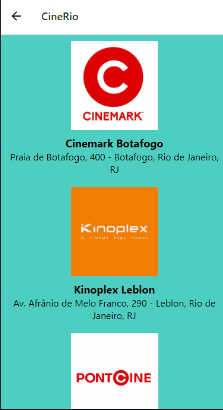
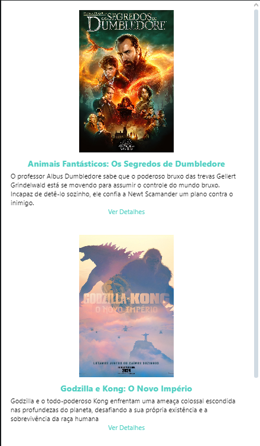

# Template Padrão da Aplicação

O template do site é composto pelos seguintes layouts:
- Tela Home
- Tela Cidades
- Tela Cinemas
- Tela Filmes
- Tela Assentos
- Tela Login/Cadastro
---

<h3>TELA HOME</h3>

Na tela home, temos as seguintes opções: 
- Escolher a cidade desejada.
- E também podemos acessar o menu, que está na NavBar, onde contém algumas opções disponíveis que nos direciona para outras telas do App.

---
<h3>TELA CIDADES</h3>

Na tela de cidades, temos as opções das cidades disponíveis e também conseguimos acessar o menu através da NavBar.

---

<h3>TELA CINEMAS</h3>

Após escolher a cidade desejada, o usuário é direcionado para a tela de cinemas disponíveis de acordo com a cidade escolhida.

---

<h3>TELA FILMES</h3>

Tela de filmes disponíveis de acordo com o cinema escolhido. Também é possível ver as informações do filme e reservar o ingresso ao selecionar "VER DETALHES".

---

<h3>TELA LOGIN/CADASTRO</h3>

Caso possuir, basta fazer o login. (TELA LOGIN)

Se o usuário não possuir uma conta, ele poderá criar a conta. (TELA CADASTRO) 

---
<h3>TELA ASSENTOS</h3>

Tela onde o usuário ver e escolher os assentos que estão disponíveis.

Também pode escolher o tipo de ingresso

