# Programação de Funcionalidades

Pré-requisitos: <a href="2-Especificação do Projeto.md"> Especificação do Projeto</a>, <a href="3-Projeto de Interface.md"> Projeto de Interface</a>, <a href="4-Metodologia.md"> Metodologia</a>, <a href="3-Projeto de Interface.md"> Projeto de Interface</a>, <a href="5-Arquitetura da Solução.md"> Arquitetura da Solução</a>

Implementação do sistema descritas por meio dos requisitos funcionais e/ou não funcionais. Deve relacionar os requisitos atendidos os artefatos criados (código fonte) além das estruturas de dados utilizadas e as instruções para acesso e verificação da implementação que deve estar funcional no ambiente de hospedagem.

# Tela Home e login ( Mayra Rodriguez)

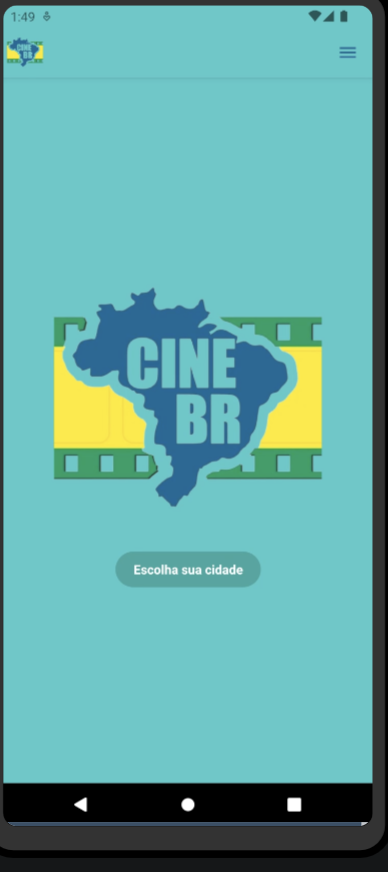
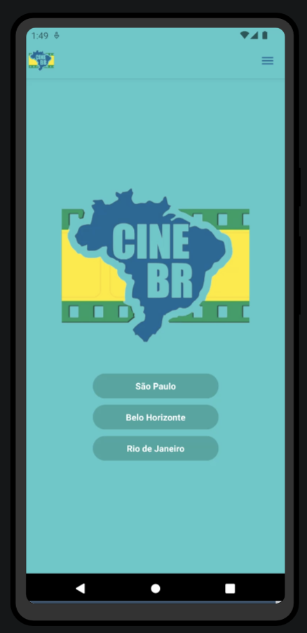
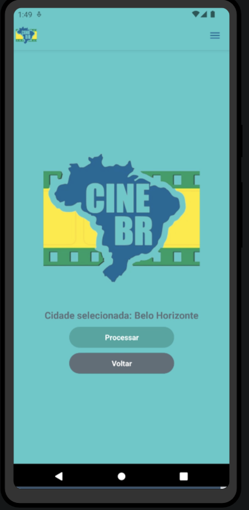
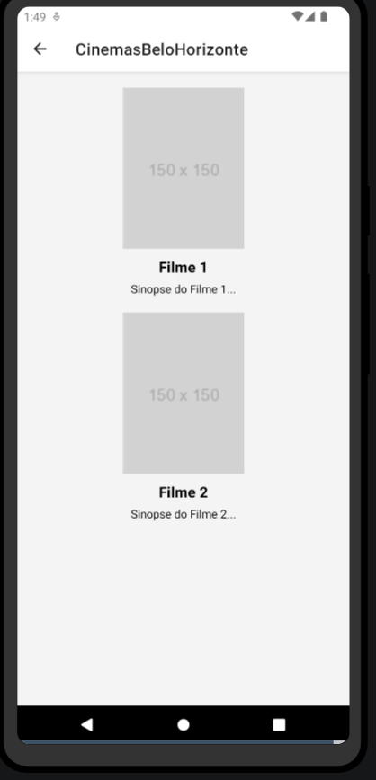
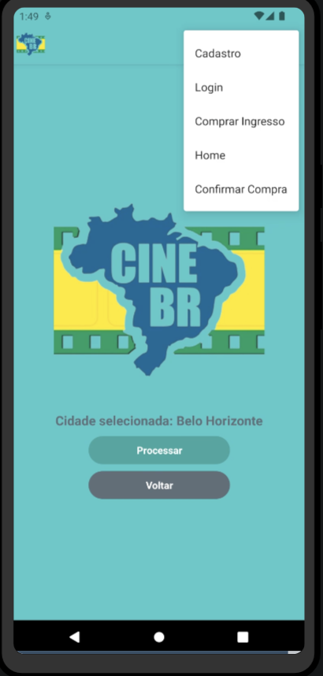

* [Transições de telas ](https://www.youtube.com/watch?v=s1EU2fECQ1Y)

Nesse video acima mostra como esta as transiçoes entre as telas.

Ao implementar essa pagina necessitei estudar os microfundamento da quinta etapa, a principio não encontrei dificuldades a fazer essa parte, foi criado botoes mas de momento não carrega nenhum link, tambem há um cabeçario com menus mas de momento não estão funcionando.
Na 3 etapa implementei complementos para a tela Home e tambem fiz a parte de navegaçao, foi um pouco mais complexa que a etapa anterior mas tudo saiu de forma correta. 

Implementação do Login e Fake API
1. Login:
Desenvolvimento da Página de Login: Eu criei uma página onde os usuários podem inserir suas credenciais, como e-mail e senha, para fazer login.

Autenticação: Após receber as credenciais do usuário, validei-as com os dados armazenados. Se forem válidas, concedi acesso; caso contrário, exibi uma mensagem de erro.

Gerenciamento de Sessão: Implementei um sistema para manter uma sessão ativa após o login, garantindo que o usuário permaneça identificado em outras partes do aplicativo.

2. Fake API:
Criação dos Dados Fictícios: Desenvolvi um conjunto de dados fictícios que representam os recursos acessados pela API. Isso foi feito em arquivos JSON, conforme orientação do professor Will.

Definição dos Endpoints da API: Estabeleci endpoints para a API que retornam os dados fictícios conforme necessário. Incluí endpoints para autenticação e obtenção de dados.

Simulação de Requisições: Em vez de fazer requisições HTTP para um servidor remoto, simulei as respostas da API localmente. Acessei os dados fictícios armazenados e os retornei como resposta às solicitações.

Comentário:
Encontrei dificuldades ao realizar essa tarefa, pois não achei que o microfundamento abordou esses conceitos de maneira clara. No entanto, segui as orientações do professor Will e busquei apoio adicional, criando um acesso no Render para compartilhar com o grupo e utilizando o Git para gerenciar um repositório contendo os arquivos JSON. Espero que essa abordagem ajude a esclarecer o processo para todos os envolvidos e a melhorar a colaboração no projeto.

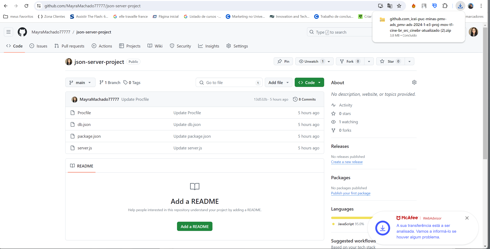
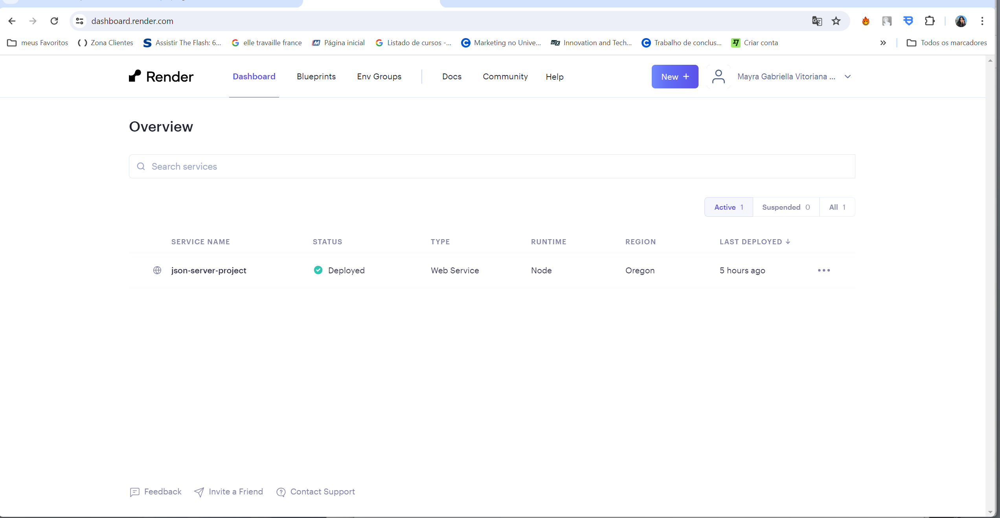
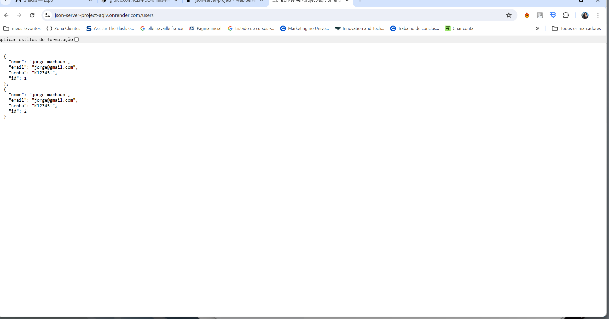
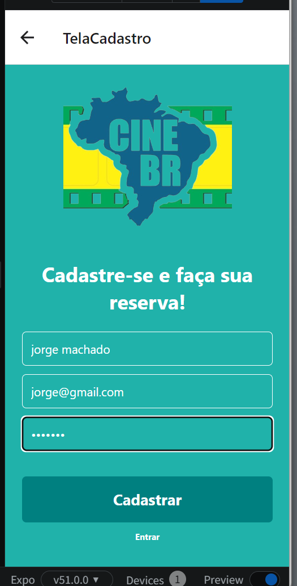
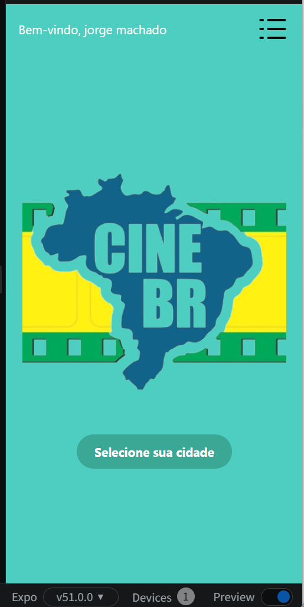

# Tela de Cadastro ( Arthur Oliveira )

> **Links Úteis**:
>
> - [Trabalhando com HTML5 Local Storage e JSON](https://www.devmedia.com.br/trabalhando-com-html5-local-storage-e-json/29045)
> - [JSON Tutorial](https://www.w3resource.com/JSON)
> - [JSON Data Set Sample](https://opensource.adobe.com/Spry/samples/data_region/JSONDataSetSample.html)
> - [JSON - Introduction (W3Schools)](https://www.w3schools.com/js/js_json_intro.asp)
> - [JSON Tutorial (TutorialsPoint)](https://www.tutorialspoint.com/json/index.htm)

# Tela do Filme ( Bianca Santana )

Até o momento, no desenvolvimento dessa página, apenas alterei um pouco do estilo do texto, diposição dos botões e estilo dos botões. Para isso estudei o microfundamento Desenvolvimento de Aplicações Móveis da quinta etapa.  

# Tela Cinemas (Geovanne do Monte)

# Tela Assentos (Geovanne do Monte / Bia Santana)

# Tela Filme (Bia Santana)

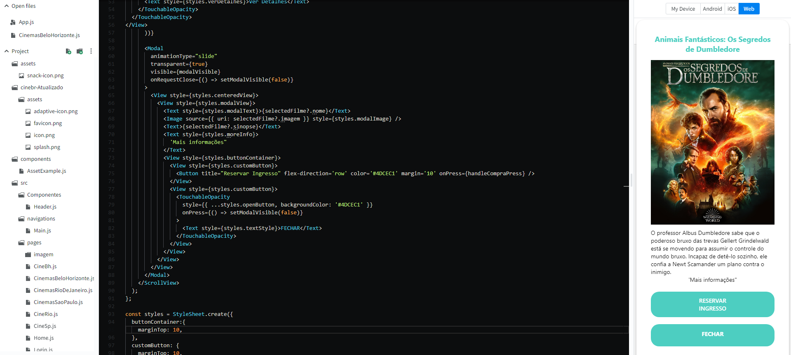

# Tela Filme (Peterson)

A tela mostra os filmes disponíveis no cinema selecionado.

