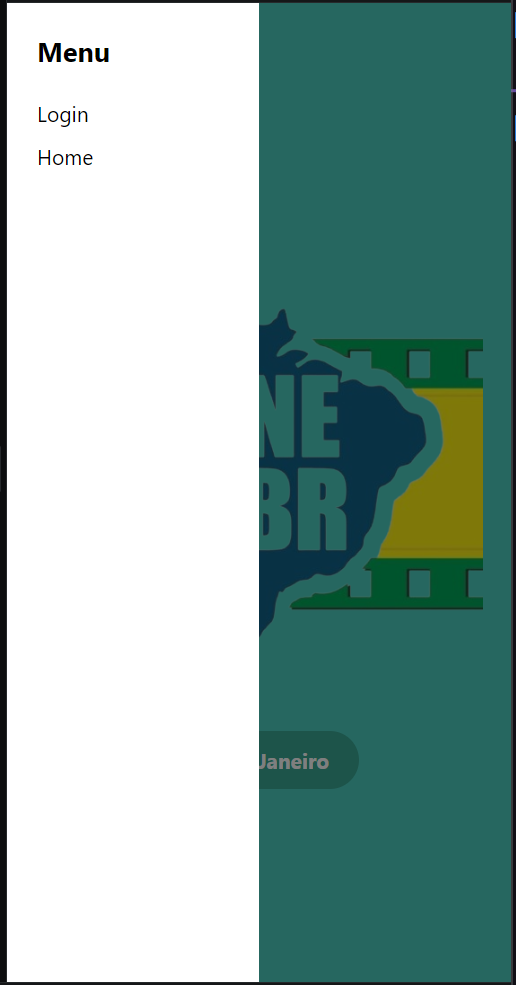

# Registro de Testes de Software

Os resultados obtidos nos testes de software realizados são descritos abaixo.

Instruções de acesso

Acesse o App

## CT-01 Home

Passos:

* Acessar a tela principal:

* Escolher a cidade:

* Escolher a cidade Sao Paulo

* Escolher a cidade Belo Horizonte:

* Escolher a cidade Rio de Janeiro:

* Barra de Menu funcional:

## CT-02 Cadastro

* Acessar a Tela de cadastro
* Verificar se a tela de cadastro é exibida corretamente, incluindo: 
  Campos para inserção de nome, e-mail e senha. 
  Botão de confirmação de cadastro.
  

* Preencher o formulário com informações válidas.
  

* Clicar no botão de confirmação de cadastro.
* Verificar se a tela de confirmação de cadastro é exibida corretamente.
  

## CT-03 Cinemas

* Acessar a Tela Cinemas.
* Verificar se a tela Cinemas é exibida corretamente.
* Clicar no cinema escolhido.
* Verificar se a tela Filmes em Cartaz é exibida corretamente.

  

## CT-04 Filmes

* Acessar a Tela Filmes em Cartaz.
* Verificar se a tela Filmes em Cartaz é exibida corretamente.
* Clicar no filme escolhido.
* Verificar se a tela com detalhes sobre o filme é exibida corretamente.

  

obs: falta ainda adicionar o campo com as informações de classificação, avaliação e horários.

## CT-05 Assentos

* Acessar a Tela Assentos.
* Verificar se a tela Assentos é exibida corretamente e se há assentos disponíveis.
* Clicar no assento escolhido.

 

